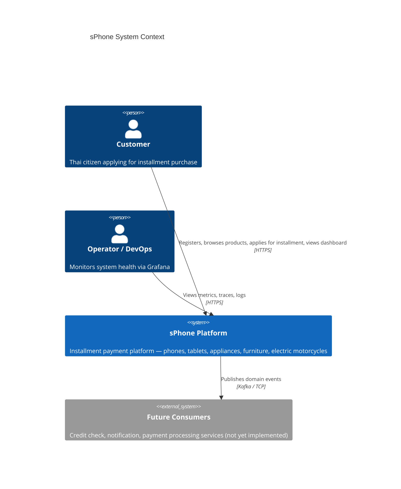
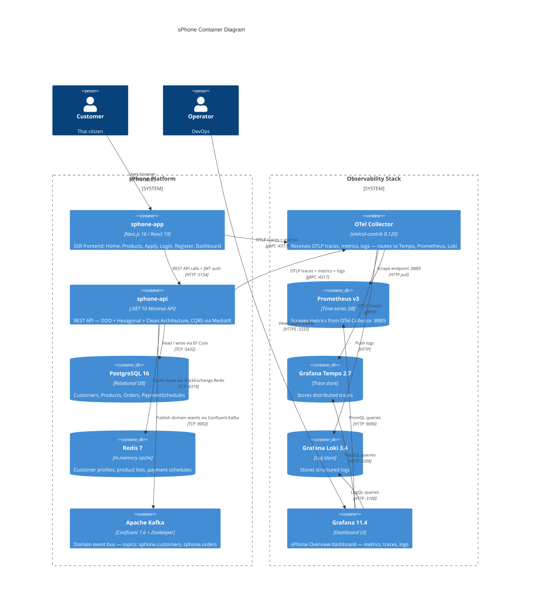
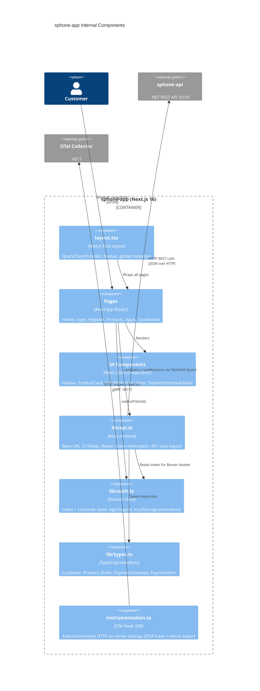
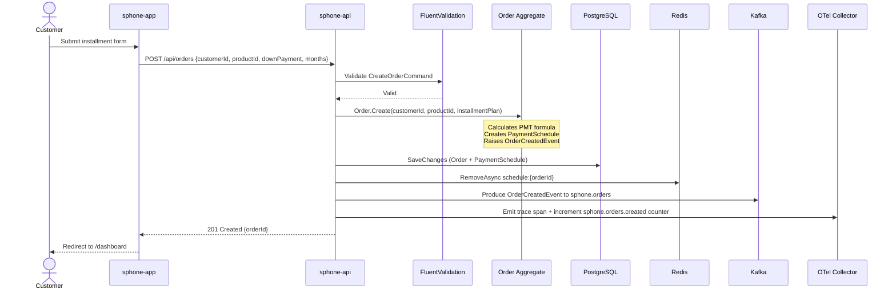

# sPhone — C4 Architecture Diagrams

---

## Level 1 — System Context

---

## Level 2 — Container Diagram

---

## Level 3 — Component Diagram: sphone-api

```mermaid
C4Component
  title sphone-api Internal Components

  System_Ext(app, "sphone-app", "Next.js frontend")
  System_Ext(postgres, "PostgreSQL", "Database")
  System_Ext(redis, "Redis", "Cache")
  System_Ext(kafka, "Kafka", "Message bus")
  System_Ext(otel, "OTel Collector", "Telemetry")

  Container_Boundary(api, "sphone-api (.NET 10)") {
    Component(endpoints, "Endpoints", "Minimal API", "Auth / Customer / Product / Order / Payment routes")
    Component(middleware, "ExceptionMiddleware", "ASP.NET Middleware", "Domain 400, NotFound 404, Unhandled 500 ProblemDetails")
    Component(mediator, "MediatR Pipeline", "CQRS Dispatcher", "ValidationBehavior then Command or Query Handler")
    Component(cmd_auth, "Auth Commands", "MediatR Handlers", "RegisterCustomerHandler, LoginCustomerHandler")
    Component(cmd_order, "Order Commands", "MediatR Handlers", "CreateOrderHandler: PMT calc, PaymentSchedule, event publish")
    Component(qry_products, "Product Queries", "MediatR Handlers", "GetProductsHandler, GetProductByIdHandler — Redis cache")
    Component(qry_customer, "Customer Queries", "MediatR Handlers", "GetCustomerProfileHandler — Redis cache, GetMyOrdersHandler")
    Component(qry_payment, "Payment Queries", "MediatR Handlers", "GetPaymentScheduleHandler — Redis cache")
    Component(domain, "Domain", "Pure C#", "Aggregates: Customer, Product, Order, PaymentSchedule. Events + Port interfaces")
    Component(repos, "Repositories", "EF Core / Npgsql", "CustomerRepo, ProductRepo, OrderRepo, PaymentScheduleRepo + SPhoneDbContext")
    Component(cache_svc, "RedisCacheService", "StackExchange.Redis", "ICacheService: GetAsync, SetAsync, RemoveAsync with JSON serialisation")
    Component(eventbus, "KafkaEventBus", "Confluent.Kafka", "IEventBus: publishes to sphone.customers and sphone.orders topics")
    Component(jwt, "JwtTokenService", "Microsoft.IdentityModel", "Generates 24h JWT with CustomerId and NationalId claims")
    Component(obs_ext, "ObservabilityExtensions", "OpenTelemetry SDK", "Traces, metrics, OTLP export, Prometheus scrape, SPhoneMetrics counters")
  }

  Rel(app, endpoints, "HTTP REST + JWT Bearer")
  Rel(endpoints, middleware, "Request pipeline")
  Rel(endpoints, mediator, "ISender.Send(command or query)")
  Rel(mediator, cmd_auth, "Dispatch")
  Rel(mediator, cmd_order, "Dispatch")
  Rel(mediator, qry_products, "Dispatch")
  Rel(mediator, qry_customer, "Dispatch")
  Rel(mediator, qry_payment, "Dispatch")
  Rel(cmd_auth, domain, "Creates Customer aggregate")
  Rel(cmd_order, domain, "Creates Order + PaymentSchedule aggregates")
  Rel(cmd_auth, repos, "Save via ICustomerRepository")
  Rel(cmd_order, repos, "Save via IOrderRepository + IPaymentScheduleRepository")
  Rel(qry_products, cache_svc, "Cache-aside read/write")
  Rel(qry_customer, cache_svc, "Cache-aside read/write")
  Rel(qry_payment, cache_svc, "Cache-aside read/write")
  Rel(qry_products, repos, "DB fallback on cache miss")
  Rel(qry_customer, repos, "DB fallback on cache miss")
  Rel(qry_payment, repos, "DB fallback on cache miss")
  Rel(cmd_auth, jwt, "GenerateToken(customer)")
  Rel(cmd_order, eventbus, "PublishAsync(OrderCreatedEvent)")
  Rel(cmd_auth, eventbus, "PublishAsync(CustomerRegisteredEvent)")
  Rel(repos, postgres, "SQL via Npgsql + EF Core")
  Rel(cache_svc, redis, "GET / SET / DEL")
  Rel(eventbus, kafka, "Produce JSON message")
  Rel(obs_ext, otel, "OTLP gRPC :4317")
```

---

## Level 3 — Component Diagram: sphone-app

---

## Data Flow: Create Order (Happy Path)

