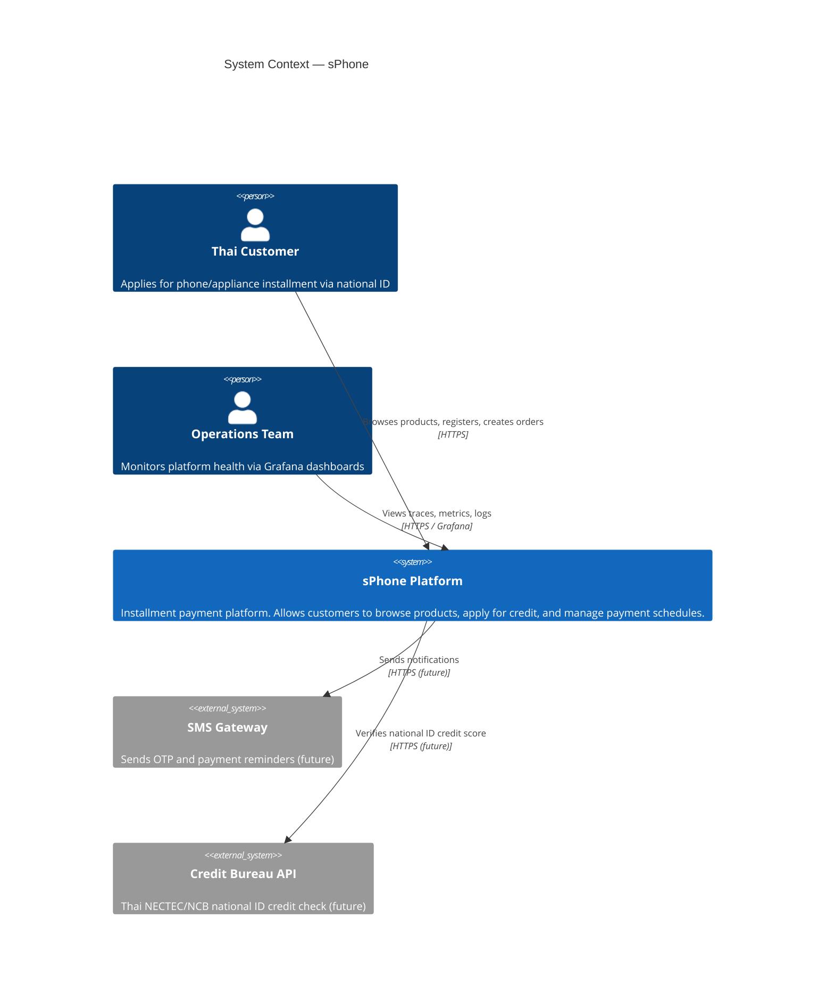
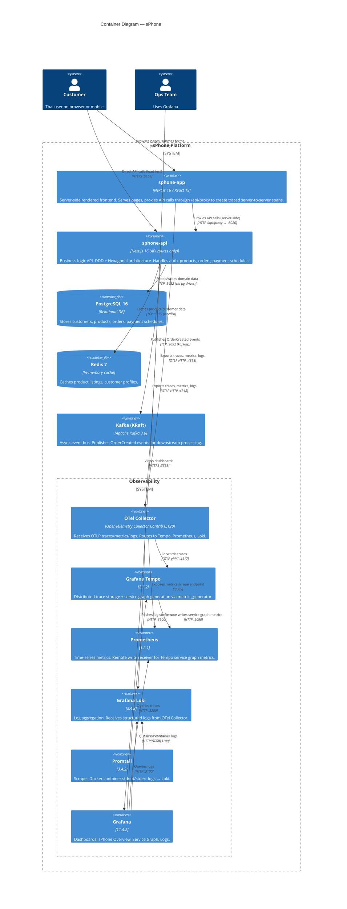
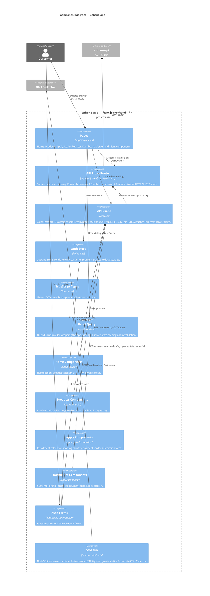
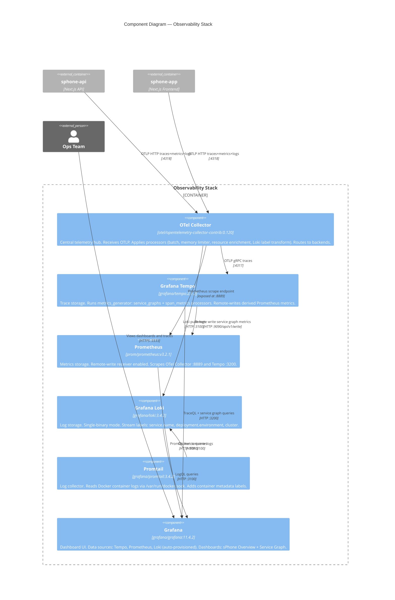
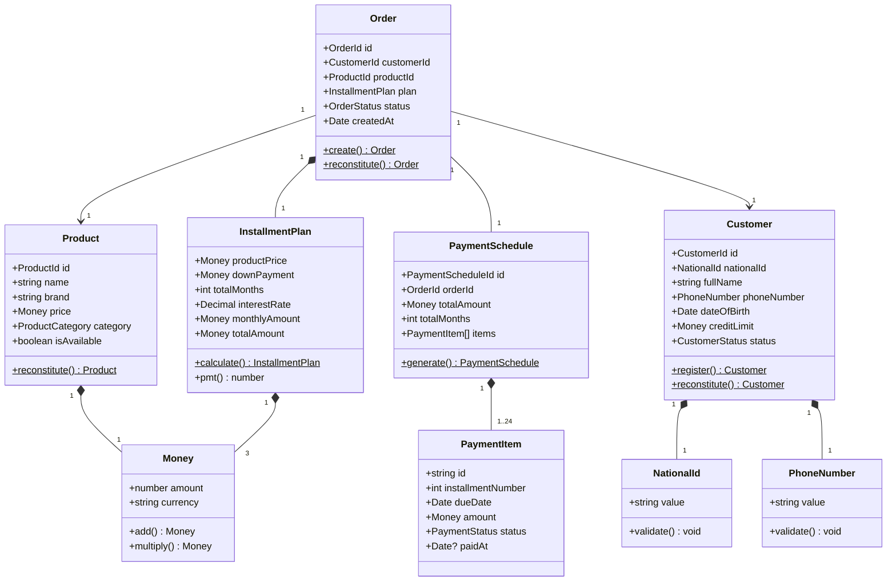
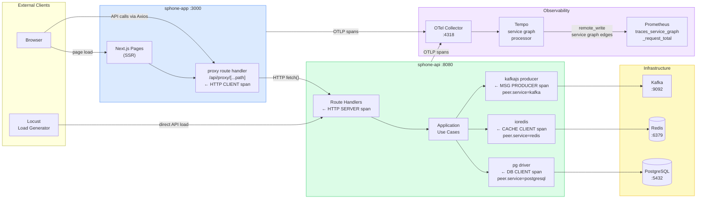

# C4 Architecture Diagrams — sPhone

> Diagrams use the [C4 model](https://c4model.com/) rendered with [Mermaid](https://mermaid.js.org/).
> Levels: **Context → Containers → Components → Code**

---

## Level 1 — System Context

Who uses the system and what external systems does it interact with.

---

## Level 2 — Container Diagram

The high-level technology choices and how containers communicate.

---

## Level 3 — Component Diagram: sphone-api

Internal architecture of the API container (DDD + Hexagonal).

```mermaid
C4Component
  title Component Diagram — sphone-api

  Container_Ext(app, "sphone-app", "Next.js frontend")
  Container_Ext(locust, "Locust", "Load generator")
  ContainerDb_Ext(postgres, "PostgreSQL", "")
  ContainerDb_Ext(redis, "Redis", "")
  Container_Ext(kafka, "Kafka", "")
  Container_Ext(otel, "OTel Collector", "")

  Container_Boundary(api, "sphone-api — Next.js API") {

    Component(routes, "Route Handlers", "Next.js app/api/**/route.ts", "Thin HTTP adapters. Parse requests, call application use cases, return JSON responses.")
    Component(authMw, "JWT Middleware", "_middleware/auth.ts", "Extracts and validates Bearer token from Authorization header.")
    Component(cors, "CORS Middleware", "src/middleware.ts", "Allows requests from sphone-app origin.")

    Component(authUC, "Auth Use Cases", "application/customers/", "RegisterCustomer, LoginCustomer commands with Zod validation.")
    Component(productUC, "Product Use Cases", "application/products/", "GetProducts, GetProductById queries with Redis caching.")
    Component(orderUC, "Order Use Cases", "application/orders/", "CreateOrder command — validates credit, computes PMT installment plan, publishes event.")
    Component(paymentUC, "Payment Use Cases", "application/payments/", "GetPaymentSchedule query.")

    Component(customerDomain, "Customer Domain", "domain/customers/", "Customer aggregate, NationalId + PhoneNumber value objects, CustomerRegisteredEvent.")
    Component(productDomain, "Product Domain", "domain/products/", "Product aggregate, Money value object, 5 product categories.")
    Component(orderDomain, "Order Domain", "domain/orders/", "Order aggregate, InstallmentPlan VO with PMT formula, OrderCreatedEvent.")
    Component(paymentDomain, "Payment Domain", "domain/payments/", "PaymentSchedule aggregate, PaymentItem entity, auto-generated on order.")

    Component(prismaRepos, "Prisma Repositories", "infrastructure/repositories/", "PrismaProductRepository, PrismaOrderRepository, etc. Implement domain port interfaces.")
    Component(redisCache, "Redis Cache Service", "infrastructure/cache/", "RedisCacheService implements ICacheService. JSON serialisation, TTL-based expiry.")
    Component(kafkaBus, "Kafka Event Bus", "infrastructure/messaging/", "KafkaEventBus implements IEventBus. Publishes domain events as Kafka messages.")
    Component(jwtSvc, "JWT Service", "infrastructure/auth/", "JwtTokenService implements IJwtService. HS256, 24h expiry, issuer: sphone-api.")
    Component(container, "DI Container", "infrastructure/container.ts", "Composition root. Wires all dependencies — repositories, services, use cases.")
    Component(prismaClient, "Prisma Client", "infrastructure/db/prisma.ts", "PrismaClient + PrismaPg adapter (Node.js pg driver). Enables OTel pg instrumentation.")

    Component(instrumentation, "OTel SDK", "instrumentation.ts", "NodeSDK with auto-instrumentations. Sets peer.service on pg/ioredis/kafkajs spans for Tempo service graph.")
  }

  Rel(app, routes, "HTTP requests", "HTTPS")
  Rel(locust, routes, "HTTP requests", "HTTPS")
  Rel(routes, authMw, "Authenticated routes pass through")
  Rel(routes, authUC, "Calls")
  Rel(routes, productUC, "Calls")
  Rel(routes, orderUC, "Calls")
  Rel(routes, paymentUC, "Calls")

  Rel(authUC, customerDomain, "Uses")
  Rel(productUC, productDomain, "Uses")
  Rel(orderUC, orderDomain, "Uses")
  Rel(paymentUC, paymentDomain, "Uses")

  Rel(authUC, container, "Resolves deps from")
  Rel(productUC, container, "Resolves deps from")
  Rel(orderUC, container, "Resolves deps from")
  Rel(paymentUC, container, "Resolves deps from")

  Rel(container, prismaRepos, "Creates")
  Rel(container, redisCache, "Creates")
  Rel(container, kafkaBus, "Creates")
  Rel(container, jwtSvc, "Creates")
  Rel(prismaRepos, prismaClient, "Uses")

  Rel(prismaClient, postgres, "Queries via pg driver", "TCP :5432")
  Rel(redisCache, redis, "GET/SET/DEL", "TCP :6379")
  Rel(kafkaBus, kafka, "Produce messages", "TCP :9092")
  Rel(instrumentation, otel, "Exports spans, metrics, logs", "OTLP HTTP :4318")

  UpdateLayoutConfig($c4ShapeInRow="4", $c4BoundaryInRow="2")
```

---

## Level 3 — Component Diagram: sphone-app

Internal architecture of the frontend container.

---

## Level 3 — Component Diagram: Observability Stack

How telemetry data flows through the observability pipeline.

---

## Level 4 — Code: Domain Model (sphone-api)

Key domain aggregates and their relationships.

---

## Service Graph — Trace Topology

How distributed traces flow and how Tempo builds the service graph.

